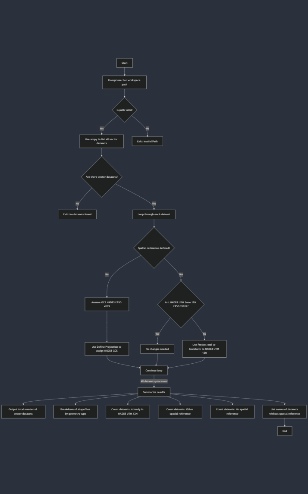

# Geoprocessing Script


This Python script automates the geoprocessing of GIS vector datasets in a given workspace. It ensures all datasets use the **NAD83 UTM Zone 12N** spatial reference system by checking, defining, or reprojecting datasets as needed. The script supports both shapefiles and geodatabase feature classes and summarizes projection statistics to help users standardize their spatial data.

## Overview

- **Author:** Matt Findlay  
- **Date:** January 31, 2025  
- **Latest Version:** 1.5  
  

## Features

- Recursively searches a user-defined workspace for vector datasets.
- Checks each dataset's spatial reference.
- Assigns NAD83 (EPSG: 4269) if the projection is missing.
- Reprojects datasets to NAD83 UTM Zone 12N (EPSG: 26912) if needed.
- Summarizes the results:
  - Total datasets processed
  - Geometry type breakdown (Point, Polyline, Polygon)
  - Number of datasets already correctly projected
  - Number of datasets reprojected
  - Number of datasets that were undefined
  - Lists names of datasets without a defined spatial reference

## Flowchart

The diagram below outlines the logic of the script:



## Installation

1. **Requirements**:
   - Python 3.9+
   - ArcGIS Pro (with `arcpy` package)

2. **Clone the repository**:
   ```bash
   git clone https://github.com/yourusername/gis-geoprocessing-script.git
   cd gis-geoprocessing-script
   ```

3. **Run the script**:
   ```bash
   python geoprocess.py
   ```

## Usage

When prompted, enter the full path to your workspace directory (e.g., `C:\GIS\Lab8\MyData.gdb`).

The script will process all shapefiles and feature classes in the directory, update projections if needed, and output a detailed summary to the terminal.

## Example Output

```
Total vector datasets processed: 8
Shapefile breakdown by geometry type:
  Point: 3
  Polyline: 2
  Polygon: 3
Datasets already in NAD83 UTM 12N: 5
Datasets reprojected to NAD83 UTM 12N: 2
Datasets that had undefined projections fixed: 1
Datasets without a defined spatial reference:
  parcels.shp
```

## Author

**Matt Findlay**  
Email: [mfindlay@ucalgary.ca](mailto:mfindlay@ucalgary.ca)

## License

This project is licensed under the MIT License.
